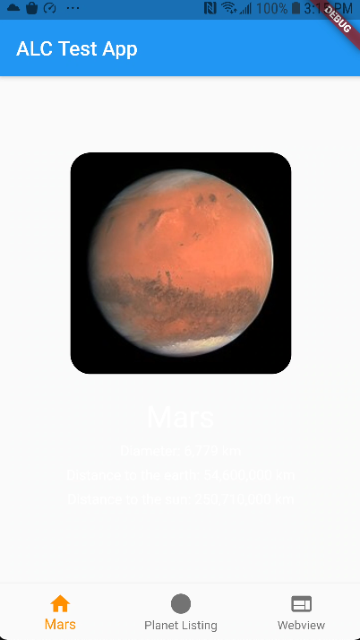

# Mobile (Flutter) Dev Assignment

This assignment will be a representation of your development skills and approaches. It should take a couple of hours to complete. Use “ALC Test App”* as a starting point, to complete the tasks below.
The test app can be completed on the platform of your choice (Android or iOS).

**You will either receive a zip file, or a link to the app repo.*

### { Before you begin! }

“Clean code always looks like it was written by someone who cares.”
― Robert C. Martin, Clean Code: A Handbook of Agile Software Craftsmanship

As "Uncle Bob" notes above and as *crafters of code*, we aim for efficiency, consistency, and readability. 
While adhering to the best practices of our domain, separation of concerns, decoupling code (models v. services etc.) and clean, readable naming conventions. 
All go a long way in creating a well-rounded project!

## What you will be graded on

- Demonstration of core OOP principles (Abstraction / Encapsulation / Polymorphism / Inheritance) in Dart (or Kotlin/Swift if applicable).
- Separation of concerns (SoC) - e.g., decoupled, clean code!
- A well-functioning bug-free mobile app (try/catch implementation + unit tests).
- Professional, clean, commented, defensively coded, easily readable code with as little duplication as possible (SoC!).

## Getting started

- The app should run on Flutter version 2.2.3 (on the stable channel), utilizing Dart 2.13.4.
- If you do notT have Flutter already installed - please take a look at the official guide to get started on the OS of your choice (Windows, macOS, Linux, Chrome OS): [https://flutter.dev/docs/get-started/install](https://flutter.dev/docs/get-started/install).
- You can confirm your version of flutter by running: `flutter --version`.
- To run this app, use the command: `flutter run`
  (**NOTE:** This app can be run on either *Android* or *iOS*).

If time permits, feel free to tackle items marked “Optional”. However, they are not mandatory.

### Overview

The assignment will include four primary objectives:

- Consume/handle data from an API endpoint.
- Create/improve widgets to display the appropriate UI.
- Implement a WebView using a third-party library.
- Writing unit tests.

Make sure to handle different states throughout the app where appropriate (e.g., idle, loading, error, etc.).
While not required, if you are familiar with an architectural pattern (e.g., MVVM/MVC),  structure your code accordingly for models,
REST APIs and services etc. Feel free to reorganize the folders/files/code that fits best with your solution!

### Requirements

1. On the first/home tab (**Mars**), retrieve and display Mars summary data from a REST endpoint:
    1. Use the following endpoint: [https://neonfish.net/mars_api.json](https://neonfish.net/mars_api.json) to retrieve the required JSON data.
    2. Once the data has loaded, display the planet’s name, and use the **imageThumbnail** URL in the JSON to display an image.
    3. Add a toggle button to show/hide the text (from the JSON above) that will display the distance from the earth to the sun.
2. On the second tab (**Planet Listing**), modify the widgets and functions:
    1. Modify **TodaysDisplay** widget. The date should fade in and out at a speed of 1 second. The date should be in the MM DD, YYYY format (you may use a third-party Flutter library from [https://pub.dev/](https://pub.dev/) to handle the formatting if needed).
    2. Show a list of the planets from **planetsList** ordered by radius in descending order. Create a new function to sort the list (should be testable!).
3. On the third tab (**WebView**), display the ALC homepage in a WebView:
    1. Set up a WebView using a third-party library. You may use: [https://pub.dev/packages/native_webview](https://pub.dev/packages/native_webview) (use 
the following webpage: [https://www.alc.ca/content/alc-mobile/en.html](https://www.alc.ca/content/alc-mobile/en.html) for your initial URL in the WebView).
4. Write unit tests:
    1. Write a unit test for **isSameTimeOfDay** function in **PlanetListingModel**.
    2. Write a unit test for **filterPlanetsByMinRadius** function in **PlanetListingModel**.

#### Bonus points! (optional)

1. Show *all* text from the JSON payload, properly formatted on the home/Mars tab below the image.
2. Add a progress indicator for the WebView loading state (ex: 50%).
3. Write a widget test for any of the views in the app.
4. Display a random fact (single line of text) about the planet (the fact should be randomized on each load) for the first/home tab.

## How the application should work and look from a user perspective

Upon launching the app, the user should be taken to the Home Screen, or the **first tab/icon**, to see the title on the Top Bar, along with the retrieved image of Mars on the home screen (text shown below the image as described in “Requirements” and “Bonus Points”).  With three icons on the bottom navigation bar showing “Mars”, “Planet Listing” and “WebView”.

The user can select the **second tab/icon**, “Planet Listing”, which will display the date at the top of the screen (underneath the App Title).  The text list of planets, which can be a simple list of text values that shows the planet names within our solar system. Displaying the list can be optioned from the following:

1. **Use the hard coded list within the class/model to display data.**
    1. **Optional:** expand the hard coded list to include additional relevant data.
2. **Optional:** Fetch data remotely via REST/JSON for the list (hint: Google using the search “list of planets using JSON”).

Clicking the **last tab/icon** will bring the user to a Fullscreen WebView that loads the URL provided in the requirements above.

Navigating between the screens should reload the data in the respective tabs. Feel free to incorporate any fades/animation between switching screens, and add any design touches to the bottom navigation and top bar.
